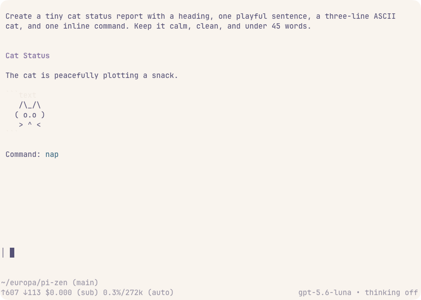
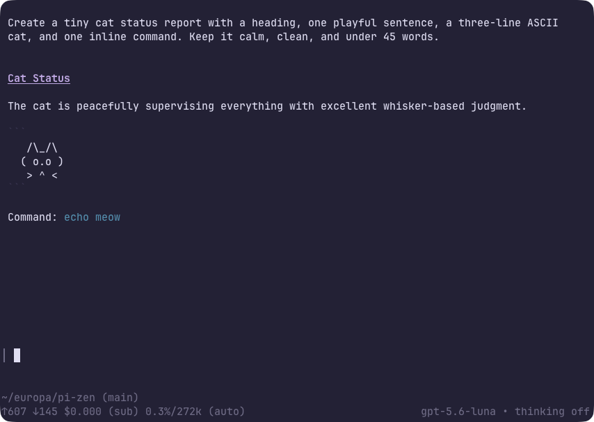
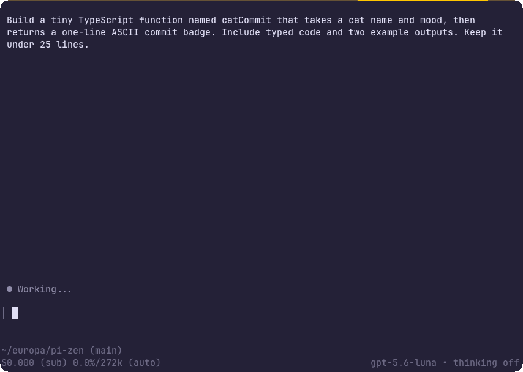

# pi-zen

I built `pi-zen` because I wanted a minimal interface that made it easier to stay present in an agent session. I did not want to keep scrolling through long stretches of context to find the few details I needed; I wanted a clean way to follow along, ask questions, and steer and ride the loop.

For real knowledge work, I like being an active participant. I want to understand what is happening between the AI and me so we can be good partners in making decisions. `pi-zen` gives me that space: clear responses, visible progress, and the useful parts of the session in a calm, visually appealing interface.

`pi-zen` is a presentation extension for the [Pi](https://pi.dev) terminal interface. It removes visual clutter while preserving conversations, tool activity, reasoning, and session data. It adds compact tool summaries and diffs, a minimal editor rail, a quieter startup, and a calmer working indicator without changing tool execution or model prompts.

## Showcase

### Light mode



### Dark mode



### Coding cat demo



## Quick start

Install the extension from npm:

```sh
pi install npm:pi-zen
```

You can also install the latest version directly from GitHub with `pi install git:github.com/Roshvan/pi-zen`. Start Pi as usual, then run `/zen` to toggle Zen mode.

## Development

You will need Node.js 22.19 or newer and pnpm. Clone the repository, install the dependencies, and start Pi with the local extension:

```sh
git clone https://github.com/Roshvan/pi-zen.git
cd pi-zen
pnpm install
pnpm dev
```

Before submitting a change, run `pnpm check` and `pnpm pack:check`.

## Issues and contributions

Issues and pull requests are welcome. If you have an idea, find a bug, or want to improve something, feel free to open an issue or create a pull request. I am happy to look it over.
