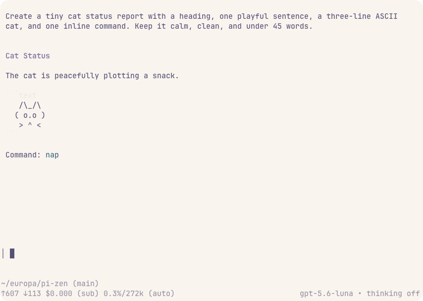
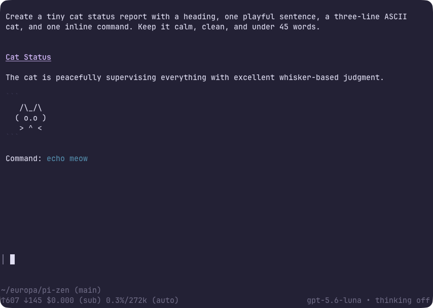
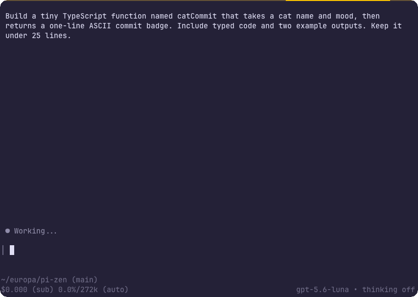

# pi-zen

I built `pi-zen` because I wanted a minimal interface that made it easier to stay present in an agent session. I did not want to keep scrolling through long stretches of context to find the few details I needed; I wanted a clean way to follow along, ask questions, and steer and ride the loop.

For real knowledge work, I like being an active participant. I want to understand what is happening between the AI and me so we can be good partners in making decisions. `pi-zen` gives me that space: clear responses, visible progress, and the useful parts of the session in a calm, visually appealing interface.

`pi-zen` is a presentation extension for the [Pi](https://pi.dev) terminal interface. It removes visual clutter while preserving conversations, tool activity, reasoning, and session data. It adds compact tool summaries and diffs, a minimal editor rail, a quieter startup, a quiet loading mark, and a live reading of where the current request's time is going, without changing tool execution or model prompts.

## Showcase

### Light mode



### Dark mode



### Coding cat demo



## While a request runs

While a request is in progress, a light travels a short bar above the editor and comes back.

A dim line above the editor says where the time is going and updates as the request runs:

```text
7.2s thinking · 3.6s writing · ↑6.5k ↓5.8k
```

Thinking is the time the model spends reasoning, including the silence before it streams anything; writing is the time it spends producing text and tool calls. Time a tool spends running belongs to neither and is left out. The token counts follow Pi's footer: tokens sent, excluding cache reads and writes, and tokens produced, reasoning included. Both cover the whole request, however many turns it takes. A half of the work that took no measurable time is left out, so a model that does not stream its reasoning simply reads as writing. The final reading stays until the next request starts.

## Expanded rows

Expand a completed `.md` or `.markdown` write or full-file read to see rendered Markdown. Headings, lists, tables, links, and fenced code use the active Pi theme, the same way Pi draws a reply. A partial or truncated Markdown read keeps Pi's own view. The collapsed transcript keeps its one-line summary.

Expand a read or write of source to see the file's line numbers and syntax colors. A line that does not fit continues under its own indent, so the block still reads as code. A read with a line limit shows just those lines, and its row says how many more the file holds; a truncated read keeps Pi's own view, with its continuation notice.

A codemode script collapses to one row, named by its comment, with the answer beside it when that answer is one short line. Expanding the row lists the calls inside the script, the same way a read or a grep would read on its own.

## Quick start

Requires Pi 1.0.4 or newer. Zen draws tool calls through Pi's tool renderer API, so it never re-registers or wraps a tool: what runs, and how, is Pi's alone.

Install the extension from npm:

```sh
pi install npm:pi-zen
```

You can also install the latest version directly from GitHub with `pi install git:github.com/Roshvan/pi-zen`. Start Pi as usual; Zen is on. Run `/zen` to toggle it, or `/zen on` and `/zen off` to choose; the choice holds across `/new`, `/resume`, and `/reload` until Pi exits. Tool rows drawn while Zen is off keep Pi's own frame, and `/reload` redraws earlier rows in the current look.

Zen also quiets Pi's startup screen. If `quietStartup` is off in your global Pi settings, Zen turns it on, says so once, and records in `pi-zen.json`, next to those settings, that the change was its own; `/zen off` turns it back off, even after a restart. Zen never touches a project's `quietStartup`, and if you turn the global one off again yourself, it stays off. Zen follows the active theme, including one picked with `/settings`, and gives its colors back when it is switched off.

## Development

You will need Node.js 22.19 or newer and pnpm. Clone the repository, install the dependencies, and start Pi with the local extension:

```sh
git clone https://github.com/Roshvan/pi-zen.git
cd pi-zen
pnpm install
pnpm dev
```

Before submitting a change, run `pnpm check` (typecheck and lint) and `pnpm pack:check`.

## Issues and contributions

Issues and pull requests are welcome. If you have an idea, find a bug, or want to improve something, feel free to open an issue or create a pull request. I am happy to look it over.
